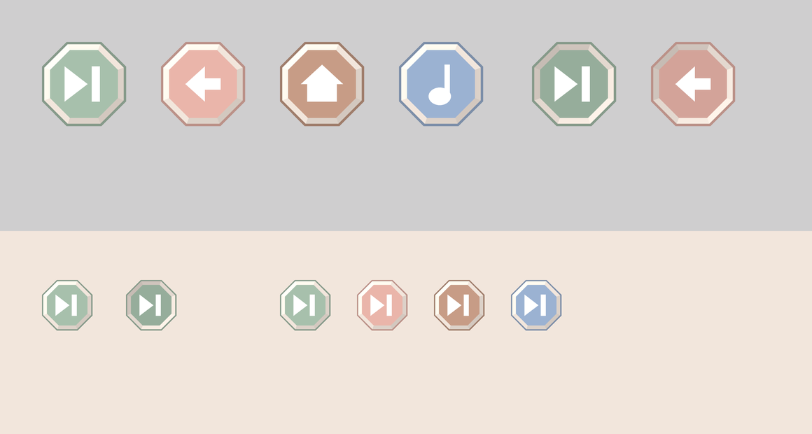

# The button — G, the faceted octagon

**Chosen: G.** It ships as `FacetButton` in
[`app/NinaBakeryPOC/Sources/UI/FacetButton.swift`](../../app/NinaBakeryPOC/Sources/UI/FacetButton.swift),
and the skip button on the opening film is the first thing wearing it.

An octagonal cap with a chamfered cream rim, a flat deep-pastel face, and one
big white glyph. Eight chamfer facets, each taking its tone from its own angle
to a single key light — the room's shading model, done in 2D because the overlay
has no renderer to do it for us.

That sheet is not a mock-up. [`render-facetbutton.py`](render-facetbutton.py)
re-implements `FacetPlate` in Python from the same constants, because this
container has no Swift toolchain and a button nobody can look at is a button
nobody can judge. Change a number in Swift, change it there, re-run.

## The candidates

Nine `flux_2` / `pro` generations at `1k`, all against the **scenes** reference
`64f0893e-073a-4065-b363-f87687ced11d`. Full-size finalists sit in this folder;
everything else is kept at 320 px in [`candidates/`](candidates/), which is
enough to judge and keeps the repo light. The seeds regenerate any of them.

| # | File | Subject | Seed | Job ID | Verdict |
|---|---|---|---|---|---|
| A | `candidates/A-hex-mint-320.png` | Hexagonal cap, three-quarter view | `26338` | `f62ee0bc-f6b8-4cc5-8f4c-134247b645f1` | Best of the three-quarter set. Came back an octagon, which is what settled the shape |
| B | `candidates/B-coin-pink-320.png` | Twelve-sided coin | `390852` | `ccf5e1b0-2965-4cb2-827e-fd2bc5cb07bc` | Reads as a cake. Fatal in a bakery game |
| C | `candidates/C-octagon-cream-320.png` | Square slab, cut corners | `357758` | `417f867b-09f1-46f0-997a-ef3497dbbe08` | Reads as a block of butter, and the cream face leaves nothing for a white glyph |
| D | `candidates/D-family-of-three-320.png` | Three buttons, three-quarter | `190532` | `de5a3c4e-1da1-4630-bd85-4359ee01073d` | The cap-in-a-socket family works; glyphs came back the same colour as their caps and vanished |
| E | `candidates/E-press-state-320.png` | Unpressed beside pressed | `653437` | `63e4cf53-7393-4f11-95dd-c25e17b052e2` | Glyphs turned into plus signs, but the press mechanic is right there: the cap sinks, the socket stays |
| F | `candidates/F-over-scene-320.png` | Button floating over a room box | `885792` | `d0d1a85e-e61a-4d9c-ba2f-05255732f2e9` | The legibility test, and the one that proved a saturated cap survives a pastel room |
| **G** | **`G-faceon-mint.png`** | **Octagon, face-on** | `145886` | `2a566c78-dd0c-4e61-9fac-7272309ff571` | **The design.** Every number in `FacetPlate` is measured off it |
| H | `H-faceon-pink.png` | Octagon, face-on, second colour | `836724` | `849dbd37-37df-4556-8dcc-d411340cf649` | Proves the tone swaps without the design changing. Also the only glyph flux got right |
| I | `candidates/I-faceon-family-320.png` | Three face-on buttons | `795848` | `09c3e577-cf64-4418-bc8b-a94e745db43c` | Dropped every glyph and drifted the colours. A row of buttons is a prompt flux cannot hold |

Nine generations, 9 credits.

## What the passes taught

- **Ask face-on, not three-quarter.** The first three all came back as objects
  photographed on a table, which is a lovely prop and a bad control: the overlay
  is not part of the room, and a button drawn at the room's isometric angle
  looks like something she can pick up. *"Seen straight on, facing the viewer
  directly like a badge, perfectly flat to the camera"* is the phrase that
  fixed it, and it has the side benefit that the result is eight straight lines
  SwiftUI can draw exactly.
- **An octagon, not a hexagon and not a circle.** A was prompted as a hexagon
  and returned an octagon twice over; eight sides is what the model reaches for
  when asked for a faceted disc. It is also the right answer — a circle is the
  one shape that cannot be built from flat facets, and eight sides still reads
  as round at 72 pt.
- **flux cannot assemble a skip glyph.** Two triangles and a bar came back as
  triangle-bar-triangle, as two overlapping triangles, as a pair of arrows
  pointing at each other, and twice as a plus sign. It does not matter — the
  glyph in the app is an SF Symbol — but do not spend credits trying to fix it.
- **Never ask for a row of buttons.** Plate I lost every glyph and drifted all
  three colours; D kept the row but painted each glyph in its own cap's colour.
  This is the same finding as the twelve-friends cast sheet in
  `REFERENCES.md` §3, and it now has a second data point: **one object per
  plate.**
- **The plate's face colour is not the prompt's face colour.** G was asked for
  mint and measures `#ABB9AE`, which is sage. That is not a miss, it is what a
  lit facet does, and `REFERENCES.md` §4 says as much: sample a mid-tone facet,
  never the brightest one.

## From plate to code

Everything in `FacetPlate` is measured off `G-faceon-mint.png` rather than
chosen by eye:

| What | Measured | Where it lives |
|---|---|---|
| Chamfer | regular octagon, `(2−√2)/2` of the width | `Octagon.chamfer` |
| Outer deep outline | 2.7% of the width per side | `rimScale = 0.945` |
| Cream chamfer band | a further 7% per side | `faceScale = 0.805` |
| Key light | top and left facets equally bright, bottom and right equally dark → 45° up-left | `light = (−0.7071, −0.7071)` |
| Facet spread | brightest facet 1.11× base cream, darkest 0.86× | `spread = 0.13` |
| Glyph | 46% of the button's width | `FacetGlyph`, `0.42 × diameter` |

Two deliberate departures, both because a plate is photographed on studio grey
and a button lives over a bright pastel film:

- **The face is a deep palette colour, not a pale one.** White on base mint is a
  contrast ratio of 1.43. The four tones — sage, rose, sandy, berry — run 1.80
  to 2.46, which is what a 4-year-old can find without hunting. This is the
  plate's own rendered face colour translated honestly rather than its prompt's
  colour name translated literally.
- **The outer outline is deeper than the plate's.** Plate G's outline is barely
  darker than its face, which is enough on grey and not enough on cream. It is
  derived — the face taken to 80% — so a new tone is one colour and cannot drift
  out of family.

## What it does not do

- **It is not a 3D object.** The room is RealityKit; this is a `Canvas` in the
  SwiftUI overlay. Nothing generated here goes into the app as an asset — the
  plates are the brief, and the code is the implementation. That is the rule
  from `CLAUDE.md`, and unlike the opening film and the app icon this one has a
  second form, so there is no exception to make.
- **It has no disabled state.** She cannot lose and nothing is locked, so a
  greyed-out control is a state the game does not have.
- **It carries no text, ever.** The `accessibilityLabel` is Dutch and spoken;
  it reaches VoiceOver and nothing else.

## Still open

The press animation and the tone contrasts are argued from measurement, not from
watching a 4-year-old. `POC.md`'s protocol is the place to settle them, and the
question to bring to that session is the same one the snap radius has: **does
she hit it, and does she know she hit it?**
